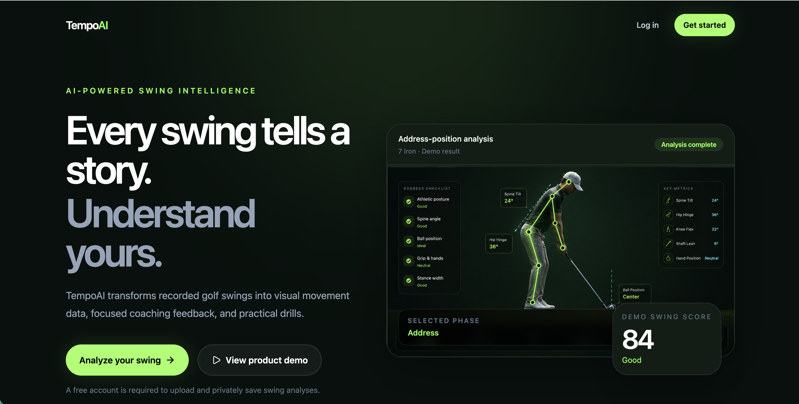
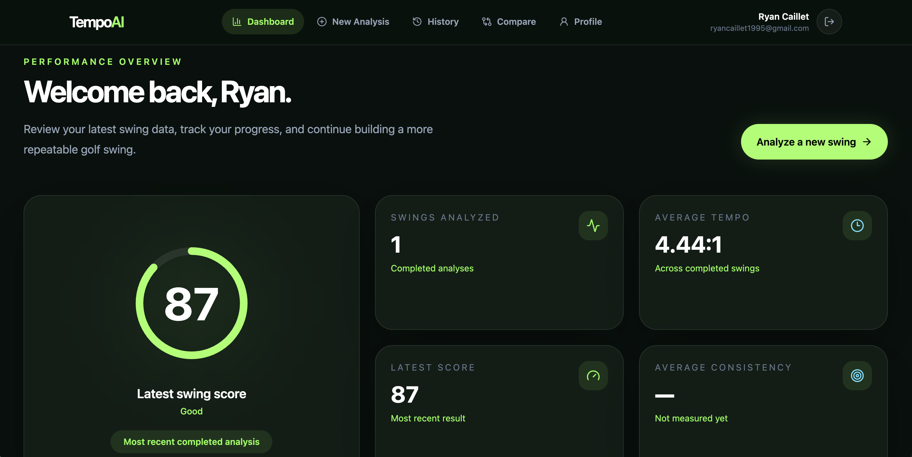
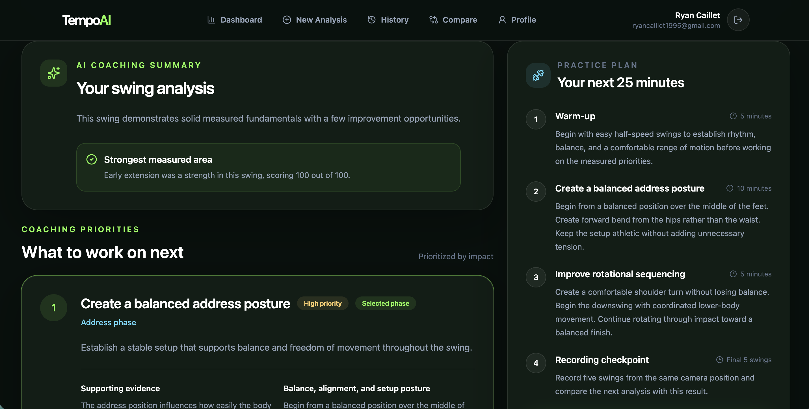
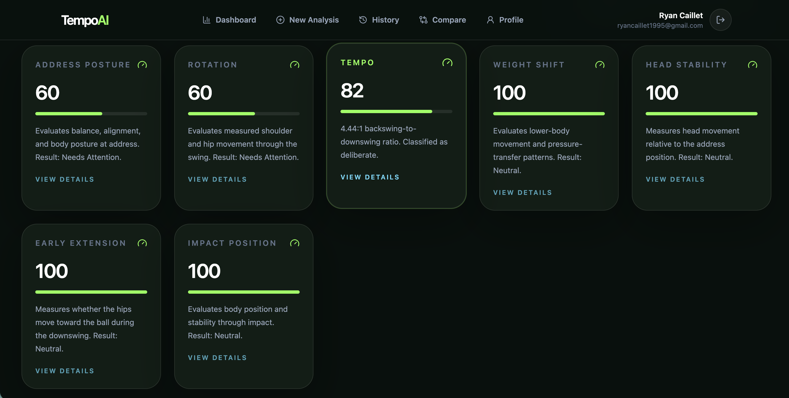

# TempoAI

TempoAI is a full-stack golf swing analysis platform that uses computer vision, deterministic motion analysis, and AI-assisted coaching to turn a golf swing video into structured, explainable feedback.

Users can upload a swing video, have it processed through a custom Python analysis pipeline, review detected swing phases and biomechanical metrics, and receive prioritized coaching feedback through a responsive web application.

## Live Application

**Live Demo:** https://tempo-ai-nu.vercel.app/

> TempoAI performs real video processing and computer vision analysis. Analysis times may vary depending on video length and server availability.

---

## Application Preview

### Landing Page



### Dashboard



### Golf Swing Analysis



### Detailed Swing Metrics



---

## Overview

Golf swing analysis is a difficult computer vision problem because recordings vary in frame rate, resolution, orientation, golfer proportions, swing speed, camera positioning, and video quality.

TempoAI was designed around that problem.

Rather than generating feedback directly from a language model, TempoAI first produces deterministic measurements from the uploaded video. Those measurements are validated, scored, and converted into structured findings before being passed into the coaching layer.

The result is an analysis pipeline where coaching feedback is grounded in measurable swing data rather than generated from the video alone.

### Analysis Pipeline

```text
Video Upload
     │
     ▼
Video Validation & Normalization
     │
     ▼
Pose Extraction
     │
     ▼
Motion Analysis
     │
     ▼
Adaptive Swing Phase Detection
     │
     ▼
Reference Geometry
     │
     ├───────────────┐
     ▼               ▼
Body Metrics     Club Detection
     │               │
     │               ▼
     │          Club Geometry
     │               │
     └───────┬───────┘
             ▼
      Metric Validation
             │
             ▼
      Findings & Scoring
             │
             ▼
        AI Coaching
             │
             ▼
       Analysis Report
```

---

## Key Features

### Video Analysis

- Golf swing video uploads
- Video validation and normalization
- Orientation handling
- Frame extraction and processing
- Pose landmark detection using MediaPipe
- Adaptive swing phase detection
- Reference-frame selection for key swing positions

### Swing Metrics

TempoAI currently evaluates:

- Tempo
- Address posture
- Impact position
- Head stability
- Weight shift
- Early extension
- Rotation
- Shaft lean
- Swing plane

Metrics are produced from deterministic geometry and motion calculations rather than asking a language model to estimate biomechanics directly from the video.

### Club Detection

TempoAI includes a custom club-detection pipeline designed to identify usable shaft geometry from video frames.

The detector includes:

- Region-based club searching
- Edge detection
- Hough line detection
- Multi-pass candidate discovery
- Segment merging
- Candidate scoring
- Hand-anchor validation
- Temporal consistency checks
- Shaft geometry smoothing
- Confidence scoring
- Geometry validation before downstream metric use

Low-quality or geometrically unreliable club detections can be rejected instead of being silently converted into misleading shaft-lean or swing-plane measurements.

### Explainable Analysis

The analysis engine produces structured intermediate results before coaching feedback is generated.

This allows TempoAI to distinguish between:

- Observed measurements
- Partial measurements
- Unavailable measurements
- Low-confidence detections

The application can therefore avoid presenting unsupported measurements as reliable swing feedback.

### AI Coaching

Structured findings from the analysis engine are converted into golfer-friendly coaching feedback.

The coaching layer can provide:

- Analysis summaries
- Strengths
- Priority improvement areas
- Metric explanations
- Practice recommendations
- Drills

The AI coaching system operates on structured analysis results rather than independently evaluating the raw video.

### Full-Stack Application

- User registration and authentication
- Secure session handling
- Video uploads
- Persistent analysis history
- Detailed analysis reports
- Swing comparison workflow
- Responsive desktop and mobile interface
- Analysis processing states
- Error handling for failed analyses
- Cloud-hosted frontend, backend, database, and media storage

---

## Technology Stack

### Frontend

- React
- TypeScript
- Vite
- Tailwind CSS
- React Router
- Framer Motion
- Lucide React
- Recharts

### Backend

- Node.js
- Express
- TypeScript
- Prisma ORM
- PostgreSQL
- Zod

### Analysis Engine

- Python
- MediaPipe Pose Landmarker
- OpenCV
- Custom geometry and motion-analysis algorithms
- Deterministic metric scoring
- Temporal club tracking and validation

### AI

- OpenAI API

### Infrastructure

- Vercel
- Render
- Neon PostgreSQL
- Cloudinary

---

## Architecture

TempoAI is separated into three major application layers:

```text
┌──────────────────────────────┐
│       React Frontend         │
│                              │
│ Uploads • Reports • History  │
│ Comparison • Authentication  │
└──────────────┬───────────────┘
               │
               │ HTTP API
               ▼
┌──────────────────────────────┐
│     Node / Express API       │
│                              │
│ Auth • Persistence • Uploads │
│ Analysis Orchestration       │
└──────────────┬───────────────┘
               │
               │ Analysis Process
               ▼
┌──────────────────────────────┐
│    Python Analysis Engine    │
│                              │
│ Pose • Motion • Phases       │
│ Geometry • Metrics • Scoring │
│ Club Detection • Coaching    │
└──────────────────────────────┘
```

This separation keeps the computer vision and numerical analysis system independent from the web application while allowing the backend to orchestrate processing and persistence.

---

## Analysis Engine Design

A major engineering goal of TempoAI was to avoid building algorithms that only work for one golfer or one recording.

The analysis pipeline is designed to work with varying:

- Swing speeds
- Video lengths
- Frame rates
- Body proportions
- Camera orientations
- Recording resolutions
- Pose-detection confidence levels

Where possible, calculations use normalized coordinates, body-relative geometry, adaptive thresholds, temporal information, and confidence-aware validation rather than fixed pixel values or assumptions tied to a specific swing.

### Swing Phase Detection

TempoAI identifies reference positions such as:

- Address
- Takeaway
- Top of backswing
- Downswing start
- Impact
- Finish

These reference frames provide a shared coordinate system for downstream metric calculations.

### Confidence-Aware Metrics

Not every video contains enough reliable information to calculate every metric.

TempoAI propagates detection quality through the pipeline so downstream metrics can determine whether their required evidence is usable.

For example, unreliable club geometry can cause a club-based metric to become incomplete rather than allowing questionable geometry to produce a confident result.

---

## Testing

The Python analysis engine includes an automated test suite covering core analysis behavior such as:

- Swing phase logic
- Geometry calculations
- Metric calculations
- Club candidate detection and scoring
- Temporal club validation
- Shaft geometry validation
- Shaft lean
- Swing plane
- Analysis report generation
- Coaching integration
- API contract generation

The frontend and backend are also validated through their TypeScript build and lint pipelines before deployment.

---

## Application Flow

1. A user creates an account or signs in.
2. The user uploads a golf swing video.
3. The backend validates and stores the upload.
4. The video is normalized for analysis.
5. MediaPipe extracts pose landmarks.
6. Motion analysis identifies the structure of the swing.
7. Adaptive phase detection locates key swing positions.
8. The geometry engine builds body-relative measurements.
9. Club detection attempts to recover reliable shaft geometry.
10. Individual golf metrics evaluate the available evidence.
11. Confidence and quality checks reject unreliable measurements.
12. Structured findings and scores are generated.
13. The coaching layer converts those findings into understandable feedback.
14. The completed analysis is persisted and displayed in the web application.
15. Previous analyses can be revisited through the user's history.

---

## Engineering Challenges

### Reliable Club Detection

Detecting a golf club from ordinary video proved significantly more difficult than pose detection because the shaft is thin, moves quickly, changes orientation dramatically, and can blend into the background.

The detector evolved to use multiple search regions, Hough passes, candidate scoring, segment merging, temporal validation, smoothing, and downstream geometry validation.

### Variable Video Input

The same swing can produce different results when videos differ in orientation, encoding, frame rate, resolution, or preprocessing.

TempoAI therefore normalizes uploaded videos before analysis and avoids relying on fixed frame numbers or absolute pixel measurements wherever possible.

### Preventing False Precision

Computer vision systems can produce plausible-looking but incorrect geometry.

Instead of assuming every successful detection is trustworthy, TempoAI tracks confidence and evidence quality throughout the pipeline. Metrics can return incomplete or partial results when the available evidence is insufficient.

This prevents questionable detections from automatically becoming authoritative coaching feedback.

---

## Repository Structure

```text
tempo-ai/
├── frontend/          # React + TypeScript web application
├── backend/           # Express + TypeScript API
├── analysis-engine/   # Python computer vision and swing analysis
├── docs/              # Architecture and product documentation
└── README.md
```

---

## Project Documentation

Additional design and architecture documentation is available in the [`docs`](./docs) directory:

- [Product Requirements](./docs/product-requirements.md)
- [System Architecture](./docs/architecture.md)
- [UI Design](./docs/ui-design.md)
- [Development Roadmap](./docs/roadmap.md)

---

## Project Status

**TempoAI v1 is complete and deployed.**

The current version includes the complete end-to-end workflow from video upload through computer vision analysis, metric generation, coaching feedback, persistence, and presentation in the web application.

Future development could include more advanced club tracking, improved multi-view analysis, larger-scale validation across golfers and recording environments, additional metrics, and infrastructure designed for higher concurrent analysis workloads.

---

## Disclaimer

TempoAI is an educational and practice-support application.

Computer vision measurements can be affected by camera position, video quality, golfer visibility, equipment visibility, lighting, and pose-detection accuracy. Results should therefore be treated as analytical feedback rather than professional instruction or biomechanical diagnosis.

TempoAI is not intended to replace instruction from a qualified golf professional.